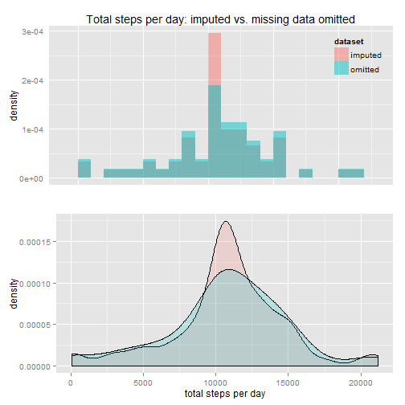

## Loading and preprocessing the data


The following function **assumes dplyr and ggplot2 are installed** and loads them if not already loaded.  
This function was adapted from maloneypatr's solution on [this web page](http://stackoverflow.com/questions/15155814/check-if-r-package-is-installed-then-load-library) at stackoverflow.


```r
load_pkgs <- function(pkg1, ...)  {
     
      # convert arguments to a vector
      packages <- c(pkg1, ...)
     
      # start loop to determine if each package is loaded
      for(package in packages)  {
            
            # if package is not loaded, load
            if(!package %in% search())  {
                  do.call("library", list(package))
                  }
            }
      }
load_pkgs(c("dplyr", "ggplot2"))
```


Per course instructions the "activity.zip" dataset is stored locally.  
Extract the dataset if needed, then format and read. 

```r
if(!file.exists("activity.csv"))  {
      unzip("activity.zip", exdir = ".")
      }
dat <- tbl_df(read.csv("activity.csv"))
```


Dataset structure

```r
glimpse(dat)
```

```
## Observations: 17568
## Variables:
## $ steps    (int) NA, NA, NA, NA, NA, NA, NA, NA, NA, NA, NA, NA, NA, N...
## $ date     (fctr) 2012-10-01, 2012-10-01, 2012-10-01, 2012-10-01, 2012...
## $ interval (int) 0, 5, 10, 15, 20, 25, 30, 35, 40, 45, 50, 55, 100, 10...
```

```r
head(dat, 3)
```

```
## Source: local data frame [3 x 3]
## 
##   steps       date interval
## 1    NA 2012-10-01        0
## 2    NA 2012-10-01        5
## 3    NA 2012-10-01       10
```

```r
tail(dat, 3)
```

```
## Source: local data frame [3 x 3]
## 
##   steps       date interval
## 1    NA 2012-11-30     2345
## 2    NA 2012-11-30     2350
## 3    NA 2012-11-30     2355
```

```r
summary(dat)
```

```
##      steps                date          interval     
##  Min.   :  0.00   2012-10-01:  288   Min.   :   0.0  
##  1st Qu.:  0.00   2012-10-02:  288   1st Qu.: 588.8  
##  Median :  0.00   2012-10-03:  288   Median :1177.5  
##  Mean   : 37.38   2012-10-04:  288   Mean   :1177.5  
##  3rd Qu.: 12.00   2012-10-05:  288   3rd Qu.:1766.2  
##  Max.   :806.00   2012-10-06:  288   Max.   :2355.0  
##  NA's   :2304     (Other)   :15840
```


Coerce "date" variable

```r
dat$date <- as.Date(dat$date)
```


## What is mean total number of steps taken per day?  

Ignore missing values for this part of the assignment (per instructions)

#### 1. Calculate total number of steps taken per day

```r
totalSteps <- dat %>%
      group_by(date) %>%
      summarise(sums = sum(steps))
```


#### 2. Histogram of total number of steps per day

```r
ggplot(totalSteps, aes(x=sums)) +
      geom_histogram(aes(fill = ..count..), binwidth = 1000) +
      geom_text(data = NULL, x = 17500, y = 8.2,
                label = "bin width = 1000", colour = "darkgray") +
      xlab("total steps") +
      ggtitle("Histogram of total steps per day")
```


#### 3. Mean and median of total number of steps per day

```r
mean(na.omit(totalSteps$sums))
```

```
## [1] 10766.19
```

```r
median(na.omit(totalSteps$sums))
```

```
## [1] 10765
```


## What is the average daily activity pattern?

#### 1. Time series plot of the 5-minute interval and average number of steps taken, averaged across all days

```r
int_averages <- dat %>%
      group_by(interval) %>%
      summarise(mean_steps = mean(na.omit(steps)))

head(int_averages, 3)
```

```
## Source: local data frame [3 x 2]
## 
##   interval mean_steps
## 1        0  1.7169811
## 2        5  0.3396226
## 3       10  0.1320755
```

Time series plot of mean of intervals

```r
ggplot(int_averages, aes(x=interval, y=mean_steps)) +
      geom_line() +
      xlab("interval id") +
      ylab("average steps") +
      ggtitle("Average steps per daily 5 minute interval")
```


#### 2. Which 5-minute interval, on average across all the days in the dataset, contains the maximum number of steps?

```r
maxInt <- int_averages %>%
      filter(mean_steps == max(mean_steps))

maxInt
```

```
## Source: local data frame [1 x 2]
## 
##   interval mean_steps
## 1      835   206.1698
```

Interval id #835 contains the maximum average number of steps, approximately 206. 

## Imputing missing values

#### 1. Total number of missing values in the dataset 

```r
length(which(complete.cases(dat) == FALSE))
```

```
## [1] 2304
```

2304 
of the 17568 rows are missing values.  

#### 2. Strategy for filling in missing values:  
Replace missing values with the mean calculated for each interval.

#### 3. New dataset with imputed values

```r
dat2 <- dat
for(i in 1:nrow(dat2))  {
      dat2[i, 1] <- ifelse(
            is.na(dat2$steps[i]),
            int_averages[which(int_averages$interval == dat2$interval[i]), "mean_steps"],
            dat2$steps[i])
            }
```


#### 4. New histogram with imputed values

```r
totalSteps2 <- dat2 %>%
      group_by(date) %>%
      summarise(sums = sum(steps))
```


```r
ggplot(totalSteps2, aes(x=sums)) +
      geom_histogram(aes(fill = ..count..), binwidth = 1000) +
      geom_text(data = NULL, x = 17500, y = 13.2, colour = "darkgray",
                label = "bin width = 1000") +
      xlab("total steps") +
      ggtitle("Histogram of total steps per day with imputed values")
```


##### 4.1 Mean and median of new dataset with imputed values

```r
mean(na.omit(totalSteps2$sums))
```

```
## [1] 10766.19
```

```r
median(na.omit(totalSteps2$sums))
```

```
## [1] 10766.19
```


#### 4.2 Differences in mean and median: new vs. old

```r
x <- mean(na.omit(totalSteps2$sums)) - mean(na.omit(totalSteps$sums))
y <- median(na.omit(totalSteps2$sums)) - median(na.omit(totalSteps$sums))
x ; y
```

```
## [1] 0
```

```
## [1] 1.188679
```

### Conclusion: 
When missing values are imputed the difference between the two datasets in mean (0) and median (1) appears insignificant. Overlaid histogram and density plots (below) show that imputation heightens and sharpens kurtosis.  


```r
########  Please note these combined overlay plots    ########              
########  were not required for the assignement; they  ########       
########  were added for visualizing the comparison.  ######## 

# Visual comparison of the two datasets  
# Overlay histogram and density plots

# combine dataframes into one after adding a new variable
# to distinguish which total steps are from which

totalSteps3 <- totalSteps ; totalSteps4 <- totalSteps2

totalSteps3$dataset <- "old"
totalSteps4$dataset <- "new"

totalSteps5 <- rbind(totalSteps3, totalSteps4)
```


```r
# These plots are better stacked on each other, so prepare
# for processing via function shown further below

p1 <- ggplot(totalSteps5, aes(sums, fill = dataset)) +
      geom_histogram(alpha = 0.5, aes(y = ..density..),
                     position = "identity", binwidth = 1000) +
      scale_fill_discrete(
            breaks = c("new", "old"),
            labels = c("imputed", "omitted")) +
      theme(legend.position = c(1, 1), legend.justification = c(1,1)) +
      theme(legend.background = element_blank()) +
      theme(legend.key = element_blank()) +
      theme(axis.ticks = element_blank(), axis.text.x = element_blank()) +
      theme(axis.title.x=element_blank()) +
      ggtitle("Total steps per day: imputed vs. missing data omitted")

p2 <- ggplot(totalSteps5, aes(sums, fill = dataset)) +
      geom_density(alpha = 0.2) +
      theme(legend.position = "none") +
      xlab("total steps per day")

# Function for arranging ggplots in one window (from S. Turner at
# http://www.gettinggeneticsdone.com/2010/03/arrange-multiple-ggplot2-plots-in-same.html)

require(grid)
vp.layout <- function(x, y) viewport(layout.pos.row=x, layout.pos.col=y)
arrange_ggplot2 <- function(..., nrow=NULL, ncol=NULL, as.table=FALSE) {
  dots <- list(...)
  n <- length(dots)
  if(is.null(nrow) & is.null(ncol)) { nrow = floor(n/2) ; ncol = ceiling(n/nrow)}
  if(is.null(nrow)) { nrow = ceiling(n/ncol)}
  if(is.null(ncol)) { ncol = ceiling(n/nrow)}
  ## NOTE see n2mfrow in grDevices for possible alternative
  grid.newpage()
  pushViewport(viewport(layout=grid.layout(nrow,ncol) ) )
  ii.p <- 1
  for(ii.row in seq(1, nrow)){
    ii.table.row <- ii.row
    if(as.table) {ii.table.row <- nrow - ii.table.row + 1}
    for(ii.col in seq(1, ncol)){
      ii.table <- ii.p
      if(ii.p > n) break
      print(dots[[ii.table]], vp=vp.layout(ii.table.row, ii.col))
      ii.p <- ii.p + 1
    }
  }
}
arrange_ggplot2(p1, p2, nrow = 2)
```




## Are there differences in activity patterns between weekdays and weekends?

#### 1. Using the new dataset create a new factor variable with two levels - "weekday" and "weekend"  

```r
dat3 <- dat2
days <- lapply(dat2$date, weekdays)
dat3$date_type  <- as.factor(ifelse(grepl("Sat|Sun", days), "weekend", "weekday"))

# I prefer this order of columns 
dat3 <- dat3 %>%
select(steps, date, date_type, interval)
```


#### 2. Panel plot of average steps per 5-minute intervals: one for weekend days, the other for weekday days.

```r
int_averages2 <- dat3 %>%
      group_by(date_type, interval) %>%
      summarise(mean_steps = mean(steps))
```


Time series panel plot of mean of intervals

```r
ggplot(int_averages2, aes(x=interval, y=mean_steps)) +
      geom_line() +
      facet_grid(date_type ~ .) +
      xlab("interval id") +
      ylab("average steps") +
      ggtitle("Average steps per daily 5 minute interval")
```


### Conclusion:  
There is an apparent difference in weekend day and weekday day interval averages. On weekdays activity sharply peaks in the early afternoon (around 2 pm). This is somewhat less apparent on weekends, which also show more activity in the later afternoon and evening than weekdays.
